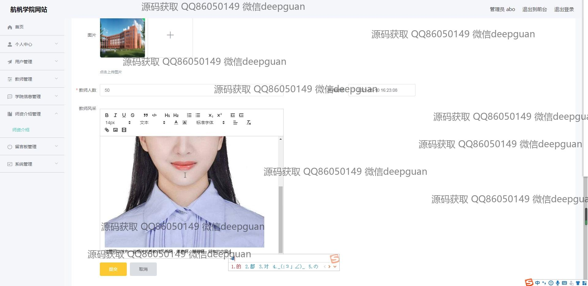
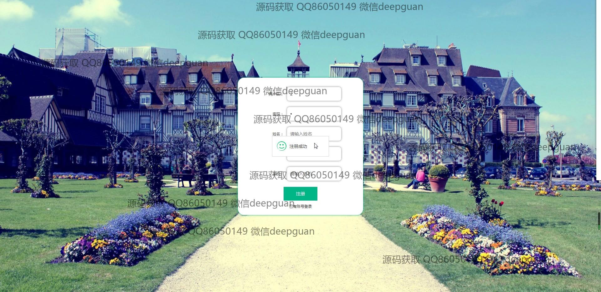
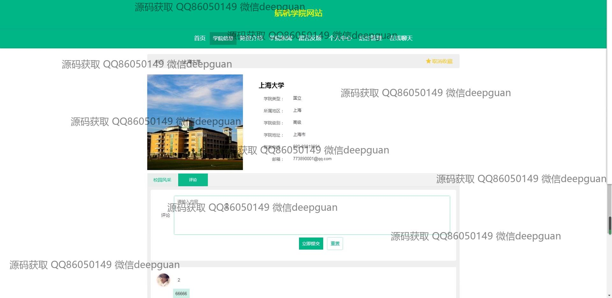

<h1 align="center">航帆学院网站设计与实现+vue</h1>

## 简介
航帆学院网站：角色分为管理员、用户；功能包括用户管理、教师管理、学院信息管理、留言板管理、在线聊天和学院新闻发布等，支持信息编辑及动态交互。    --计算机毕业设计源码；毕设源码；java毕业设计源码

## 联系方式

<h3 align="center">获取完整代码与数据库文件 + 微信：deepguan QQ: 86050149 QQ群: 783742310</h3>

<h3 align="center">可帮忙远程部署 包运行成功！提供远程部署、修改代码、设计文档指导、代码讲解等服务！</h3>

## 功能介绍（完整见运行截图）
管理员：登录和注册系统，管理教师、用户、学院信息和留言板，通过导航菜单访问个人中心和系统管理模块，提交和编辑新闻及学院信息，支持上传图片和文本编辑，管理留言和回复，实时更新并发布信息。用户：浏览主页，通过导航栏访问学院信息、师资介绍、学院新闻、留言反馈，查看大学详细信息，发表评论和留言，编辑个人资料，上传头像，使用个人中心和收藏功能查看和管理个人信息与收藏内容。教师：进入教师管理页面，添加、修改或删除教师信息，包括姓名、性别、工号、学院和联系方式，上传教师照片，描述教师风采，通过导航访问个人中心，进行个人信息管理，浏览学院新闻和信息。游客：访问网站公开页面，通过导航栏访问学院信息、师资介绍、学院新闻和留言反馈功能，查看大学或学院详细信息和新闻模块内容，发表评论与反馈建议，无需登录即可浏览公开页面的内容。

## 运行截图

本代码来源于网络,仅供学习参考使用!

